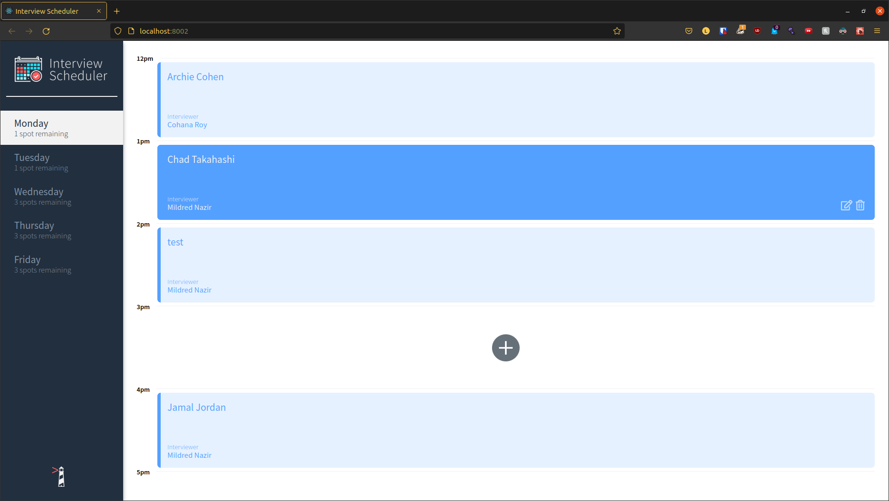
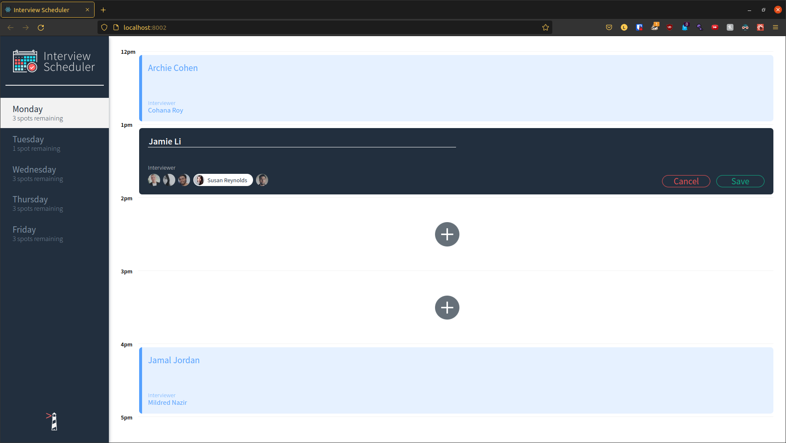
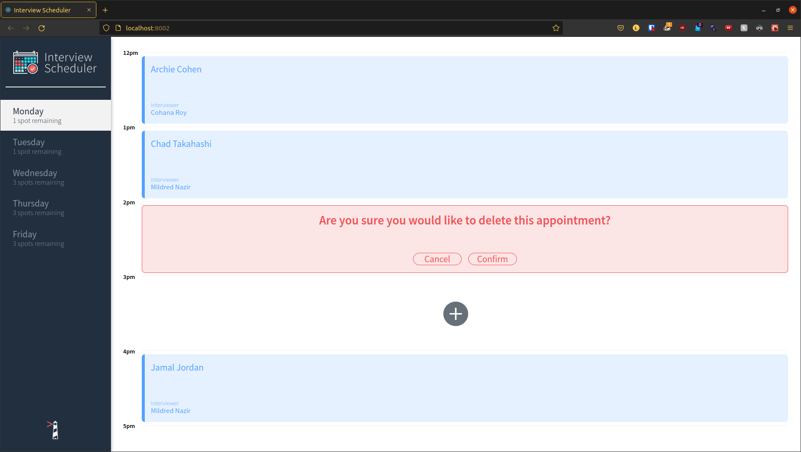
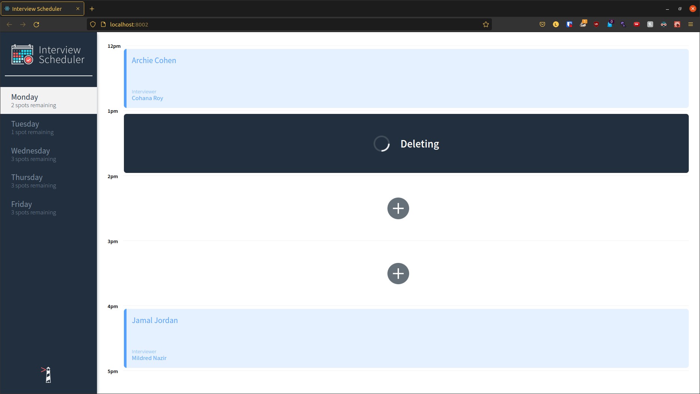

# Interview Scheduler

An interview scheduling application build with React.

This project was done during my web development bootcamp at Lighthouse Labs to learn React and various testing frameworks.

## Stack
- React
- Webpack, Bable
- Axios
- Storybook, Webpack Dev Server, Jest, Cypress
- *Stretch Websocket*

## Features
- Create an appointment
- Edit an appointment
- Delete an appointment
- Spots remaining count updates as you delete, create and edit
- Confirmation page on delete
- Loading during Async operations
- Mobile responsive

## Other Features For Future Development
- Block save if interviewer is not chosen - currently breaks the database if interviewer is left empty
- Implement Websocket
- Better test coverage

## Screenshots






## Setup

Install dependencies with `npm install`.

## Running Webpack Development Server

```sh
npm start
```

## Running Jest Test Framework

```sh
npm test
```

## Running Storybook Visual Testbed

```sh
npm run storybook
```
